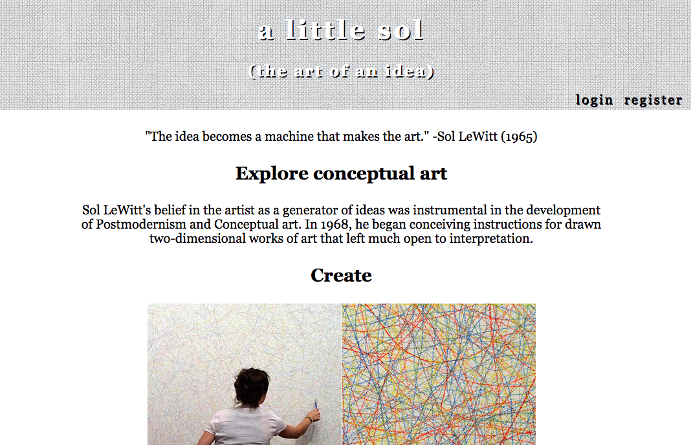
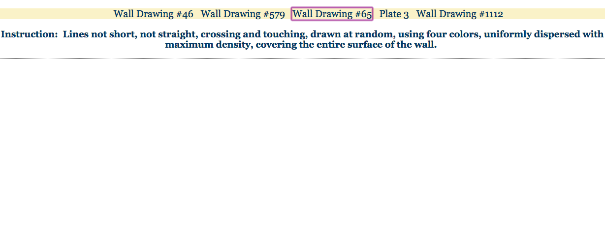

# a little sol
An interactive drawing application that introduces users to the conceptual artist Sol LeWitt.

## motivation
I wanted to explore the idea of ideas in this application. What is an idea? Who has ownership? What does it look like to engage with an idea? How does engaging with the same idea over a period of time change the nature of the idea? This is done by integrating React, HTML5, with the artwork of conceptual artist Sol LeWitt. The user can create their own versions of Sol LeWitt’s instructional art on the browser “canvas” and create and save their own gallery of work.

## screenshots
landing page:

choose a set of instructions:

canvas:

save to gallery:

## built with
* Redux
* React
* HTML5
* node.js

## features
* make your own version of sol lewitt's instructional drawings
* can save your artwork to your gallery
